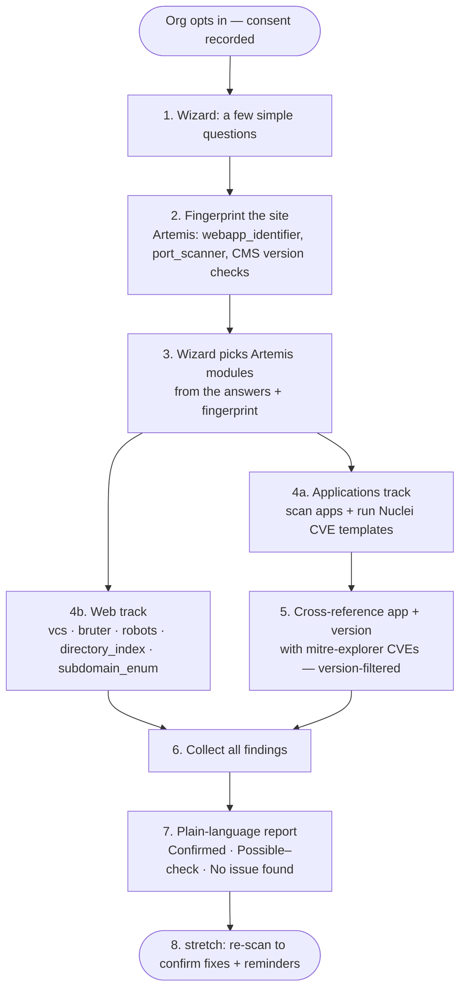

# SafetyRoutes

A vulnerability scanning tool for identifying security weaknesses across applications and infrastructure.

> **Status:** early development — project scaffolding in progress.

## In plain words

Think of SafetyRoutes as a friendly **health check-up for your organization's website**.

Many small charities, non-profits, and small businesses (we call them *local community
organizations*) don't have a tech team — but they're still targets for ransomware and
other online attacks. The weak spots are often simple things left open by accident, like
an unlocked back door, that criminals can find automatically.

With the organization's permission, SafetyRoutes looks over their website for these common
weak spots and then explains what it found in **everyday language**: what the problem is,
why it matters, and the simple steps to fix it. Later, it checks again to confirm the fix
worked, and sends a gentle reminder if anything is still open.

Behind the scenes it uses trusted, free security tools. **Artemis** (which has **Nuclei**
built in) does the checking and writes the reports, and a threat-intelligence database called
**MITRE Explorer** connects the software an organization runs to the security flaws known to
affect it. We only ever scan organizations that have asked us to, and we do it carefully so
nothing breaks.

The goal is simple: help the organizations that protect our communities lower their risk —
without needing to be security experts themselves.

---

## RANSOMWARE DEFENCE SUMMER BOOTCAMP
*by Virtual Routes — @ Amsterdam Business School, 29 June – 3 July 2026*

### Decreasing Exposure Through Vulnerability Scanning

Design and develop a basic vulnerability scanning pipeline, focusing on vulnerabilities
that are common for Local Community Organizations (LCOs), such as SMEs or non-profits.
The sessions will help participants understand what vulnerability scanning is exactly,
how to conduct scans responsibly, how this helps to protect organizations, and how such
information should be communicated with a non-technical audience to stimulate awareness
and action.

**The sessions should:**

- Focus on common risks and vulnerabilities among Local Community Organizations
- Adhere to the ethical guidelines that correspond with good-faith security research
- Minimize the risks associated with vulnerability scanning
- Communicate findings in a clear and comprehensible manner
- Focus on automation and scale

**Suggestions for achieving higher impact:**

- Use CERT-PL's Artemis framework to set up automated scanning
- Select scanning modules based on open-source threat landscapes for NGOs
- Find a middle ground between technical details and actionable information
- Develop a way to confirm remediation of a vulnerability and send reminders

---

## Overview

SafetyRoutes aims to help developers and security teams discover, prioritize, and
remediate vulnerabilities. The scope, scanning targets, and tech stack are still being
defined — see the roadmap below.

## Scanning engine: Artemis

SafetyRoutes plans to automate scanning on top of
[**Artemis**](https://github.com/CERT-Polska/Artemis), the modular vulnerability scanner
built and maintained by [CERT Polska](https://cert.pl/) (CERT PL).

- **What it is:** a modular web vulnerability scanner with automatic, human-readable
  report generation. CERT PL uses it to scan and notify organizations about
  vulnerabilities at scale (hundreds of thousands reported).
- **How it works:** multiple scanning modules check different aspects of a target
  (e.g. exposed `.git` directories, outdated software such as old CMS installations,
  and other web security issues), with a web UI for managing and viewing scans.
- **Extensible:** a modular architecture allows custom modules, which is how we intend
  to extend it for SafetyRoutes' use cases.
- **Built-in CVE checks & fingerprinting:** Artemis bundles
  [**Nuclei**](https://github.com/projectdiscovery/nuclei) (`nuclei-module`) to run
  template-based checks for known CVEs, and fingerprints the software a site runs — so we
  rely on **one** engine rather than running a second scanner.
- **Deployment:** runs via Docker and Docker Compose (development mode via
  `./scripts/start --mode=development`).
- **License:** BSD-3-Clause.

> **Note:** Artemis is experimental software under active development — use at your own
> risk, and only against systems you are authorized to scan.

## Guided wizard

Most LCOs don't know which security checks they need. The **wizard** is a thin guidance
layer on top of Artemis: a few simple questions about the organization determine **which
Artemis modules run**, and the results are explained back in plain language. For the
bootcamp we deliberately keep it to **two tracks** — so it's simple and presentable within
a few days:

### 1. Applications & their CVEs

- Artemis **fingerprints the software** a site runs, and its **version where possible** —
  `webapp_identifier`, `port_scanner`, and CMS version checks (WordPress / Drupal / Joomla).
- Each detected app + version is matched against
  [**mitre-explorer.org**](https://mitre-explorer.org), which links 11K+ products to their
  known CVEs (prioritized with CISA KEV and EPSS exploit-probability data). Only CVEs
  affecting the **detected version** are considered — not the app's entire history. If a
  version can't be determined, the report says so rather than guessing.
- Artemis runs **Nuclei CVE templates** (`nuclei-module`) to actively test the
  high-priority ones.
- Each relevant CVE is reported in one of three clear states:
  - **Confirmed** — the scan actively verified it.
  - **Possible — needs manual check** — known to affect the detected app/version but not
    safely testable remotely. (*Not* a clean bill of health.)
  - **No issue found** — checked and nothing detected.

### 2. Web scanning

- Exposed files and misconfigurations: `vcs` (exposed `.git`), `bruter` (stray backups),
  `robots`, `directory_index`, and `subdomain_enumeration`.

That is the full scope for the bootcamp — **applications (cross-referenced to CVEs)** and
**web scanning**. Every other Artemis module stays off by default; more tracks can be added
to the wizard later.

## How it works — step by step

The **wizard runs first** and decides what gets scanned; the actual scanning (including
Nuclei) only runs afterwards, using the wizard's choices.

1. **Opt in** — the organization gives permission; we record consent.
2. **Wizard questions** — a few plain questions about the org and its website.
3. **Fingerprint** — Artemis detects what software (and version) the site runs.
4. **Pick modules** — the wizard turns answers + fingerprint into the module set
   (Applications + Web only, for the bootcamp).
5. **Scan** — Artemis runs the chosen modules; the **Applications** track runs Nuclei's
   CVE templates, the **Web** track checks for exposed files and misconfigurations.
6. **Cross-reference CVEs** — detected app + version is matched to mitre-explorer's
   known CVEs, filtered to that version.
7. **Reconcile** — every relevant CVE is marked **Confirmed**, **Possible — needs manual
   check**, or **No issue found**.
8. **Report** — results are written up in plain language. *(Stretch: re-scan later to
   confirm fixes and send reminders.)*

## Proposed approach

> _Draft proposal for the bootcamp challenge — open to revision._

The challenge is dual-natured: build a **basic, automated** scanning pipeline for
low-capacity organizations (SMEs, non-profits), **and** run it **responsibly** while
communicating results to **non-technical** audiences. Success is not "most findings" —
it is *decreasing exposure at scale, ethically, with remediation that actually happens*.
Artemis fits because CERT PL built it for exactly this: scan → auto-report → notify
organizations at scale. The four proposals below map to the challenge goals.

### 1. Artemis scanning pipeline (the technical core)

- Run **Artemis via Docker Compose** as the scanning engine.
- Define an **"LCO module profile"** — enable only safe, relevant, low-impact modules
  (e.g. exposed `.git`/backups, outdated CMS, open admin panels, missing security
  headers, exposed services); disable aggressive or brute-force modules.
- **Consented target intake**: domains come from an allowlist (config/CSV) only after
  ownership/permission is recorded.
- **Orchestration**: scheduled scans with throttling/rate limits to minimize impact.

### 2. Responsible-scanning safeguards (good-faith research)

- **Authorization gate**: scan only domains with recorded consent.
- **Low-impact guardrails**: passive/non-intrusive checks, no exploitation, no DoS,
  rate limiting, defined scan windows, a published abuse/contact point.
- **Scope control**: allowlist + out-of-scope blocklist; honor `security.txt` where present.
- **Audit trail**: log what was scanned, when, and with which modules.

### 3. Plain-language reporting (non-technical audiences)

- Translate Artemis findings into a **tiered report**: business-impact summary →
  prioritized "what to do" action list → optional technical appendix.
- Express severity in **plain language** ("anyone on the internet can read your internal
  files") rather than CVSS jargon.
- Per-finding remediation steps sized to an LCO's capacity.

### 4. Remediation confirmation & reminders (lasting impact)

- **Re-scan** to verify a finding is fixed, then mark it resolved.
- **Automated reminders/nudges** for findings that stay open.
- **Track exposure over time** to show progress — directly serving "Decreasing Exposure."

## Roadmap (bootcamp)

Scoped to be presentable within a few days — Applications + Web tracks only.

- [ ] Stand up Artemis via Docker Compose
- [ ] Run a test scan on **one consented site**; inspect the real fingerprint/version output
- [ ] Wizard: a few questions → enable the **Applications + Web** Artemis modules
- [ ] Join detected app + version to **mitre-explorer** CVE data (version-filtered)
- [ ] Plain-language report with the three CVE states + simple remediation steps
- [ ] _(stretch)_ Re-scan to confirm fixes and send reminders

## Getting started

_Setup instructions will be added once the stack is chosen._

## Responsible use

SafetyRoutes is intended for **authorized security testing only**. Scan only systems you
own or have explicit written permission to test. Unauthorized scanning may be illegal.

## License

To be determined.
