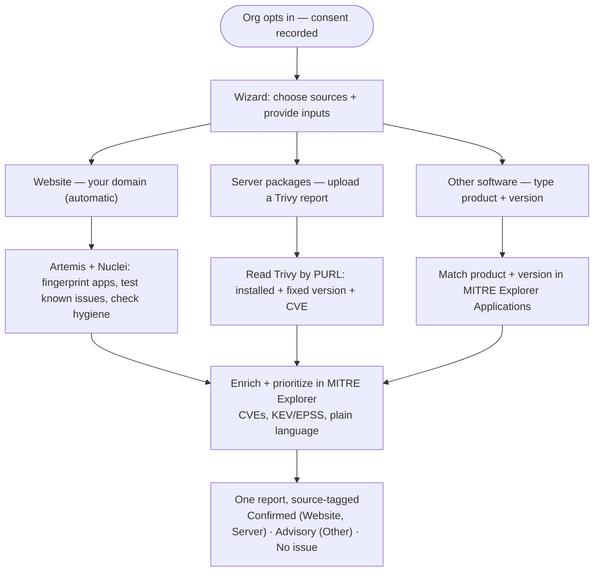
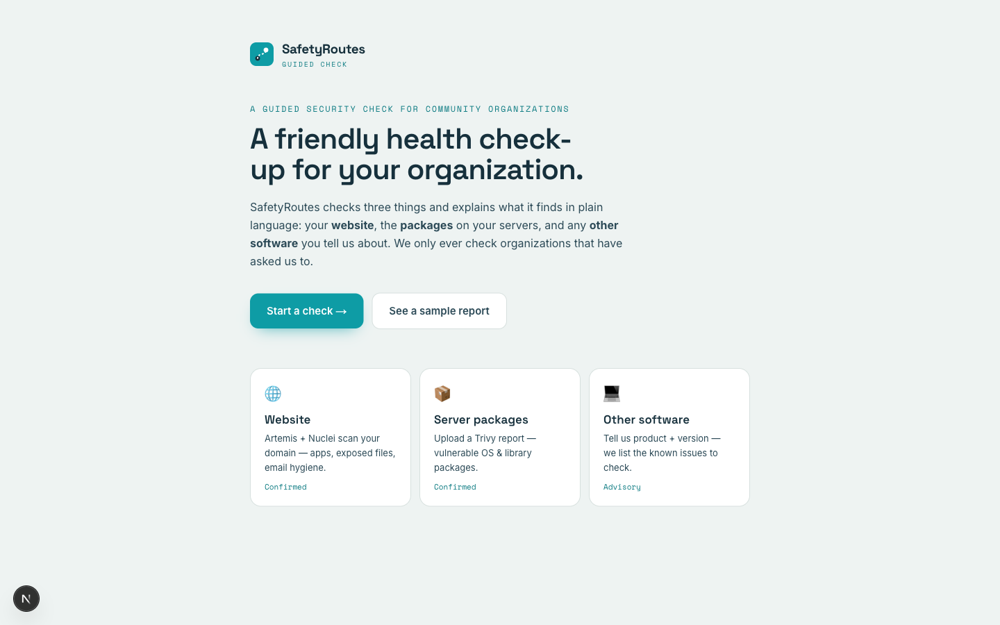
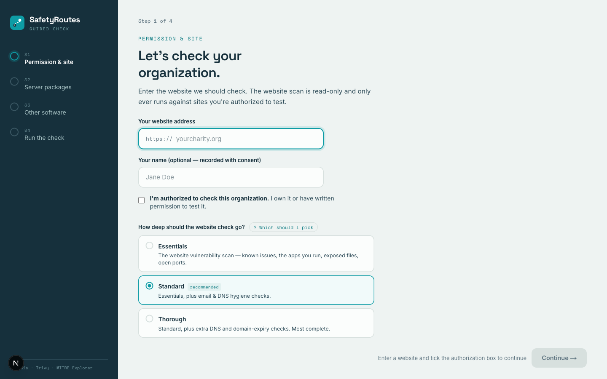
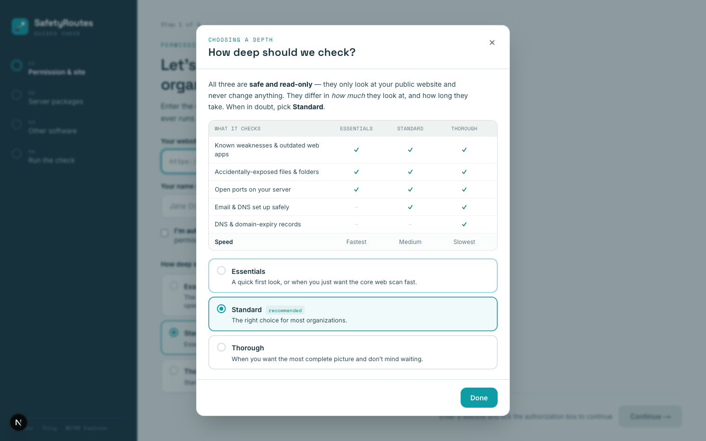
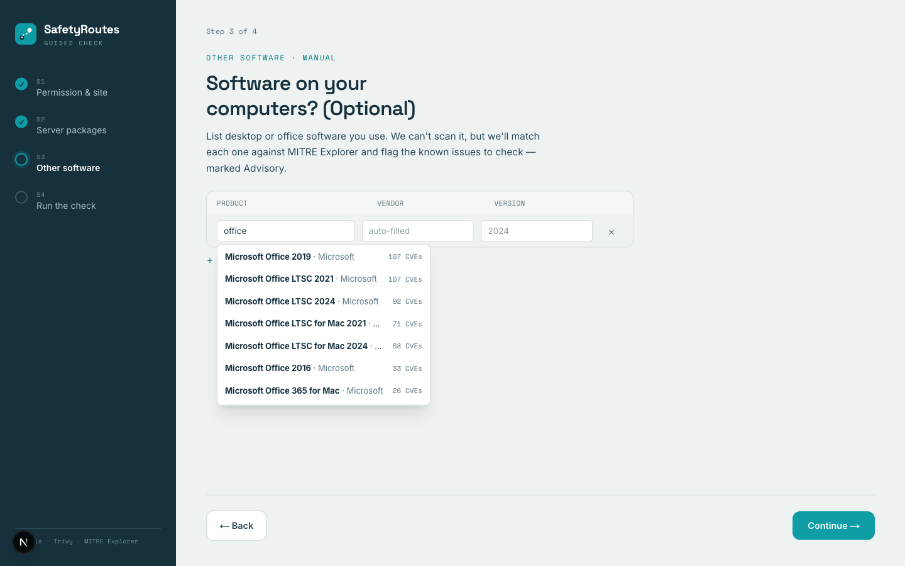
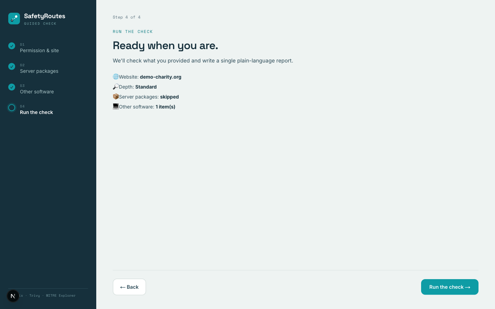
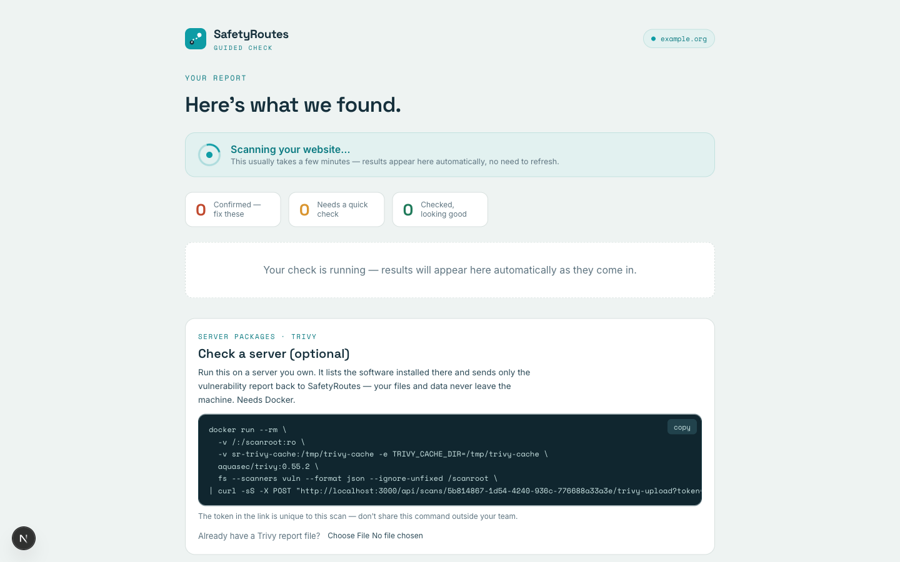
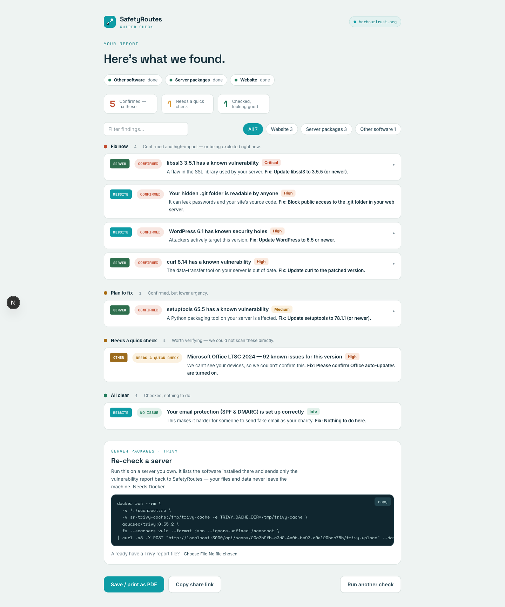
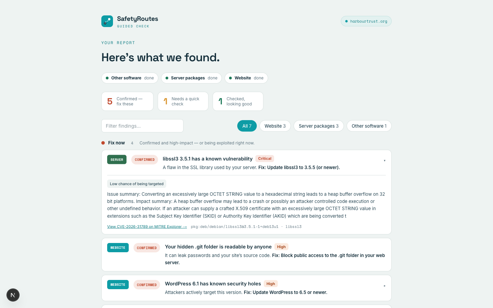

# SafetyRoutes

A vulnerability scanning tool for identifying security weaknesses across applications and infrastructure.

> **Status:** working build — a guided wizard with the Website (Artemis), Server-packages
> (Trivy), and Other-software (MITRE Explorer) tiers all functional. Built for the Ransomware
> Defence Summer Bootcamp.

## In plain words

Think of SafetyRoutes as a friendly **health check-up for your organization's website**.

Many small charities, non-profits, and small businesses (we call them *local community
organizations*) don't have a tech team — but they're still targets for ransomware and
other online attacks. The weak spots are often simple things left open by accident, like
an unlocked back door, that criminals can find automatically.

With the organization's permission, SafetyRoutes looks over their website for these common
weak spots and then explains what it found in **everyday language**: what the problem is,
why it matters, and the simple steps to fix it. Later, it checks again to confirm the fix
worked, and sends a gentle reminder if anything is still open.

Behind the scenes it uses trusted, free security tools. **Artemis** (with **Nuclei** built in)
checks the website, **Trivy** checks the packages on a server, and a threat-intelligence
database called **MITRE Explorer** connects the software an organization runs to the security
flaws known to affect it. We only ever scan organizations that have asked us to, and we do it
carefully so nothing breaks.

The goal is simple: help the organizations that protect our communities lower their risk —
without needing to be security experts themselves.

---

## RANSOMWARE DEFENCE SUMMER BOOTCAMP
*by Virtual Routes — @ Amsterdam Business School, 29 June – 3 July 2026*

### Decreasing Exposure Through Vulnerability Scanning

Design and develop a basic vulnerability scanning pipeline, focusing on vulnerabilities
that are common for Local Community Organizations (LCOs), such as SMEs or non-profits.
The sessions will help participants understand what vulnerability scanning is exactly,
how to conduct scans responsibly, how this helps to protect organizations, and how such
information should be communicated with a non-technical audience to stimulate awareness
and action.

**The sessions should:**

- Focus on common risks and vulnerabilities among Local Community Organizations
- Adhere to the ethical guidelines that correspond with good-faith security research
- Minimize the risks associated with vulnerability scanning
- Communicate findings in a clear and comprehensible manner
- Focus on automation and scale

**Suggestions for achieving higher impact:**

- Use CERT-PL's Artemis framework to set up automated scanning
- Select scanning modules based on open-source threat landscapes for NGOs
- Find a middle ground between technical details and actionable information
- Develop a way to confirm remediation of a vulnerability and send reminders

---

## Overview

SafetyRoutes is a **Next.js + PostgreSQL** app that wraps three trusted, free security tools
behind one guided wizard built for non-technical organizations: **Artemis** (+ Nuclei) checks
the website, **Trivy** checks a server's packages, and **MITRE Explorer** connects the software
an org runs to the flaws known to affect it. Three inputs → one plain-language, source-tagged
report. We only ever scan organizations that have asked us to.

## Scanning engine: Artemis

SafetyRoutes plans to automate scanning on top of
[**Artemis**](https://github.com/CERT-Polska/Artemis), the modular vulnerability scanner
built and maintained by [CERT Polska](https://cert.pl/) (CERT PL).

- **What it is:** a modular web vulnerability scanner with automatic, human-readable
  report generation. CERT PL uses it to scan and notify organizations about
  vulnerabilities at scale (hundreds of thousands reported).
- **How it works:** multiple scanning modules check different aspects of a target
  (e.g. exposed `.git` directories, outdated software such as old CMS installations,
  and other web security issues), with a web UI for managing and viewing scans.
- **Extensible:** a modular architecture allows custom modules, which is how we intend
  to extend it for SafetyRoutes' use cases.
- **Built-in CVE checks & fingerprinting:** Artemis bundles
  [**Nuclei**](https://github.com/projectdiscovery/nuclei) as **two cooperating modules**
  (both must be enabled): `nuclei-router` works out which templates fit the site, then
  `nuclei-module` runs the `nuclei` tool against it — a curated, high-severity subset, not
  every template. Artemis also fingerprints the software a site runs, so we rely on **one**
  engine rather than running a second scanner.
- **Deployment:** runs via Docker and Docker Compose (development mode via
  `./scripts/start --mode=development`).
- **License:** BSD-3-Clause.

> **Note:** Artemis is experimental software under active development — use at your own
> risk, and only against systems you are authorized to scan.

## Guided wizard

Most LCOs don't know which security checks they need. The **wizard** is a thin guidance
layer that collects up to **three inputs** and turns them into one plain-language report:
the **website** (Artemis scans the domain — tracks 1–2 below), **server packages** (a Trivy
report you upload — track 3), and **other software** (you type product + version — track 4).
Each maps to a different tool and a different confidence level:

### 1. Applications & their CVEs

- Artemis **fingerprints the software** a site runs, and its **version where possible** —
  `webapp_identifier`, `port_scanner`, and CMS version checks (WordPress / Drupal / Joomla).
- Each detected app is looked up in [**mitre-explorer.org**](https://mitre-explorer.org),
  which links 11K+ products to their known CVEs (prioritized with CISA KEV and EPSS). It
  returns the app's **full** CVE list with per-CVE version ranges; **we then keep only the
  CVEs that affect the detected version, matching on our side** (mitre-explorer has no
  version filter of its own). If a version can't be determined, the report says so rather
  than guessing.
- Artemis runs its **Nuclei** modules (`nuclei-router` + `nuclei-module`, both required) to
  actively test the high-priority checks.
- Each relevant CVE is reported in one of three clear states:
  - **Confirmed** — the scan actively verified it.
  - **Possible — needs manual check** — known to affect the detected app/version but not
    safely testable remotely. (*Not* a clean bill of health.)
  - **No issue found** — checked and nothing detected.

### 2. Web scanning

- Exposed files and misconfigurations: `vcs` (exposed `.git`), `bruter` (stray backups),
  `robots`, `directory_index`, and `subdomain_enumeration`.

### 3. Server packages (Trivy)

For installed OS and library packages on a Linux server — which a remote scan **can't see** —
the org runs **Trivy** and uploads the report:

```
trivy fs --scanners vuln --format json --output sr-report.json /
```

We read each finding by **PURL** (e.g. `pkg:deb/debian/openssl`) with its installed version,
fixed version, and CVE, then enrich via mitre-explorer's **`/packages`** knowledgebase
(severity, KEV/EPSS, ATT&CK technique, plain language). Trivy already does the version
verdict, so these are **Confirmed**. Trivy and mitre-explorer share the same ecosystems
(npm, PyPI, Go, Maven, RubyGems, NuGet, Composer; Debian/Ubuntu/Alpine/RHEL via OSV).

### 4. Other software (manual / advisory)

For desktop or office software no scanner can reach (Office, Acrobat, …), the org
self-declares **product + version**. We match it in mitre-explorer's Applications data and
list the known CVEs as **Advisory — verify locally** — never *Confirmed*, since nothing was
actively scanned.

Three inputs, one report — **Website** (Artemis + Nuclei), **Server packages** (Trivy), and
**Other software** (manual). Intrusive Artemis modules stay off by default.

## How it works — step by step

The wizard collects up to **three inputs** first; the tools run afterwards, then everything
merges into one **source-tagged** report.



1. **Opt in** — the organization gives permission; we record consent.
2. **Choose sources + give inputs** — a domain, a Trivy report, and/or a product+version list.
3. **Website** → Artemis fingerprints the apps and runs Nuclei (`nuclei-router` → `nuclei-module`),
   plus hygiene checks (`vcs`, `directory_index`, `mail_dns_scanner`).
4. **Server packages** → we read the uploaded Trivy report by **PURL** (installed + fixed
   version + CVE).
5. **Other software** → we match each declared product + version in MITRE Explorer.
6. **Enrich** → MITRE Explorer adds CVE detail, KEV/EPSS priority, and plain-language context.
7. **Report** → one source-tagged report: **Confirmed** (Website, Server) · **Advisory** (Other,
   verify locally) · **No issue found**.

## The app

Screens from the working build. The wizard collects up to three inputs, then merges everything
into one source-tagged, plain-language report.

**Landing** — what it is, and the three things it checks.



**Step 1 · Permission & site** — consent first; the website address is the real **Artemis**
target. Choose how deep the website check goes.



**Choosing depth** — a plain-language comparison of Essentials / Standard / Thorough: what each
one checks and how long it takes.



**Step 3 · Other software** — type a product and the field autocompletes against **MITRE
Explorer**, showing each version's known-CVE count. Version is required, so we match the exact
CVE set rather than guessing.



**Step 4 · Review & run** — a plain summary of everything before anything runs.



**Live scan** — the report streams in and auto-refreshes; no dead-end links while it works.



**The report** — one **source-tagged** report, findings grouped **Fix now / Plan / Check /
Clear**, each in plain language with a concrete fix. Confidence is honest: **Confirmed**
(Website / Server) · **Advisory — verify** (Other) · **No issue found**.



**A finding in detail** — CVE summary, exploitation likelihood (EPSS / CISA KEV), the affected
package, and a link straight to MITRE Explorer.



## CVE data — the mitre-explorer API

mitre-explorer is the knowledge layer for **both** the Applications tier (web-facing apps +
declared software → CVEs) **and** the Packages tier (Trivy findings → advisories). 11K+
products → 26K+ CVEs, plus ~12.8K packages → 32.5K GHSA + 489K OSV advisories, enriched with
CISA KEV and EPSS. Base URL: `https://mitre-explorer.org`.

**Lookup flow (three calls):**

1. **Resolve product → slug** — `GET /api/v1/applications?search={name}` returns matches
   with a `normalized` slug (e.g. `apache/http_server`), `vendor`, and `product`. The
   detail call needs this exact slug.
2. **Get the app's CVEs** — `GET /api/v1/applications/{vendor}/{product}` returns the app
   plus a paginated `cves[]` array (`cveId`, `cvssSeverity`, `isKev`, `publishedAt`, …).
3. **Get version ranges per CVE** — `GET /api/v1/cves/{cveId}` returns
   `affectedApps[].versionStart` / `versionEnd`. **Match the detected version here, on our
   side** — this range check is the source of truth for what's actually affected.

**Endpoints:**

| Endpoint | Purpose | Key params | Version filter? |
|---|---|---|---|
| `GET /api/v1/applications` | Search apps / resolve slug | `search`, `vendor`, `version`\*, `page`, `limit`, `sort` | Coarse\* (needs `search`/`vendor`) |
| `GET /api/v1/applications/{vendor}/{product}` | An app + its CVEs | path slug `^[a-z0-9/]+$`, `version`\*, `page`, `limit` | Coarse\* |
| `GET /api/v1/cves` | CVE list, filter by app name | `app` (substring), `version`\*, `severity`, `since`, `technique` | Coarse\* (needs `app`) |
| `GET /api/v1/cves/{cveId}` | Full CVE incl. version ranges | path `CVE-YYYY-NNNN`, `version`\* | Returns ranges; `version`\* narrows |
| `GET /api/v1/packages` | Search packages (Trivy tier) | `ecosystem`, `q`, `page`, `limit` | — |
| `GET /api/v1/packages/{ecosystem}/{name}` | A package + its advisories (GHSA + OSV) | path `ecosystem`/`name`, `version`\* | GHSA returns `vulnerableRange`/`fixedVersion`; `version`\* narrows |
| `GET /api/v1/cves/{cveId}/packages` | Packages affected by a CVE | path `CVE-YYYY-NNNN` | — |
| `POST /api/a2a` | JSON-RPC skills: `get_application_security`, `search_applications`, `search_cves`, `get_cve_detail` | per skill (+ `version`\*) | Coarse\* |

\* `version` is an optional, non-breaking param — a coarse **substring** match on the stored
version boundaries, **not** a semantic "is this version in range" check (see gotchas).
Pending deploy of mitre-explorer.

**Gotchas (verified against the mitre-explorer source):**

- **`version=` is a coarse pre-filter, not a verdict.** The optional `version` param does a
  **substring** match on `version_start`/`version_end` (so `2.5` also matches `12.5.1`, and
  misses a `2.0`–`3.0` range that contains 2.5). Use it to shrink results, then **do the real
  version-range match client-side** — that stays the source of truth. (CPE is still not
  filterable.)
- The `?app=` filter is a substring (ILIKE) match and **over-matches** (e.g. `http` hits
  many products) — prefer the slug route for accuracy.
- Newly-published CVEs may show an empty `affectedApps` until NVD CPE enrichment lands
  (can take days), so very recent CVEs may not map to an app yet.
- The A2A endpoint is **rate-limited (~50 requests/day/IP, no auth)** — fine for a demo,
  not for bulk lookups.

**Packages lookup (Trivy tier):** join Trivy findings by **PURL** or `(ecosystem,
package_name)`. The KB spans Trivy's ecosystems (npm, PyPI, Go, Maven, RubyGems, NuGet,
Composer; Debian/Ubuntu/Alpine/RHEL via OSV). **GHSA** (language) packages return
`vulnerableRange` + `fixedVersion`; **OSV** (OS-distro) packages do **not** surface ranges
here — which is fine, because **Trivy already produces the installed/fixed-version verdict**;
mitre-explorer enriches by ID (severity, KEV/EPSS, ATT&CK technique, plain language).

## Proposed approach

> _Draft proposal for the bootcamp challenge — open to revision._

The challenge is dual-natured: build a **basic, automated** scanning pipeline for
low-capacity organizations (SMEs, non-profits), **and** run it **responsibly** while
communicating results to **non-technical** audiences. Success is not "most findings" —
it is *decreasing exposure at scale, ethically, with remediation that actually happens*.
Artemis fits because CERT PL built it for exactly this: scan → auto-report → notify
organizations at scale. The four proposals below map to the challenge goals.

### 1. Artemis scanning pipeline (the technical core)

- Run **Artemis via Docker Compose** as the scanning engine.
- Define an **"LCO module profile"** — enable only safe, relevant, low-impact modules
  (e.g. exposed `.git`/backups, outdated CMS, open admin panels, missing security
  headers, exposed services); disable aggressive or brute-force modules.
- **Consented target intake**: domains come from an allowlist (config/CSV) only after
  ownership/permission is recorded.
- **Orchestration**: scheduled scans with throttling/rate limits to minimize impact.

### 2. Responsible-scanning safeguards (good-faith research)

- **Authorization gate**: scan only domains with recorded consent.
- **Low-impact guardrails**: passive/non-intrusive checks, no exploitation, no DoS,
  rate limiting, defined scan windows, a published abuse/contact point.
- **Scope control**: allowlist + out-of-scope blocklist; honor `security.txt` where present.
- **Audit trail**: log what was scanned, when, and with which modules.

### 3. Plain-language reporting (non-technical audiences)

- Translate Artemis findings into a **tiered report**: business-impact summary →
  prioritized "what to do" action list → optional technical appendix.
- Express severity in **plain language** ("anyone on the internet can read your internal
  files") rather than CVSS jargon.
- Per-finding remediation steps sized to an LCO's capacity.

### 4. Remediation confirmation & reminders (lasting impact)

- **Re-scan** to verify a finding is fixed, then mark it resolved.
- **Automated reminders/nudges** for findings that stay open.
- **Track exposure over time** to show progress — directly serving "Decreasing Exposure."

## Roadmap (bootcamp)

Scoped to be presentable within a few days — Applications + Web tracks only.

- [ ] Stand up Artemis via Docker Compose
- [ ] Run a test scan on **one consented site**; inspect the real fingerprint/version output
- [ ] Wizard: a few questions → enable the **Applications + Web** Artemis modules
- [ ] Join detected app + version to **mitre-explorer** CVE data (version-filtered)
- [ ] Plain-language report with the three CVE states + simple remediation steps
- [ ] _(stretch)_ Re-scan to confirm fixes and send reminders

## Getting started

The app lives in [`web/`](web) (Next.js + PostgreSQL). The website tier needs a running
**Artemis** (Docker Compose); **Trivy** is not installed here — it runs on the server you're
checking and uploads its JSON report.

```bash
cd web
npm install
# create web/.env.local with:
#   DATABASE_URL=postgres://…@localhost:5433/safetyroutes
#   ARTEMIS_API_URL=http://localhost:5001
#   ARTEMIS_API_TOKEN=…
#   MITRE_BASE_URL=https://mitre-explorer.org
npm run db:migrate     # apply web/db/schema.sql (idempotent)
npm run db:seed        # optional — sample report at /demo
npm run dev            # http://localhost:3000
```

## Responsible use

SafetyRoutes is intended for **authorized security testing only**. Scan only systems you
own or have explicit written permission to test. Unauthorized scanning may be illegal.

## License

To be determined.
